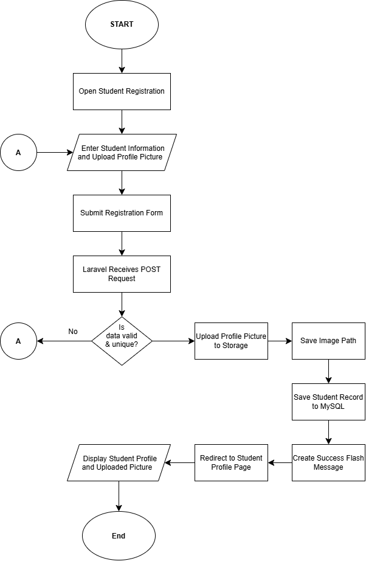
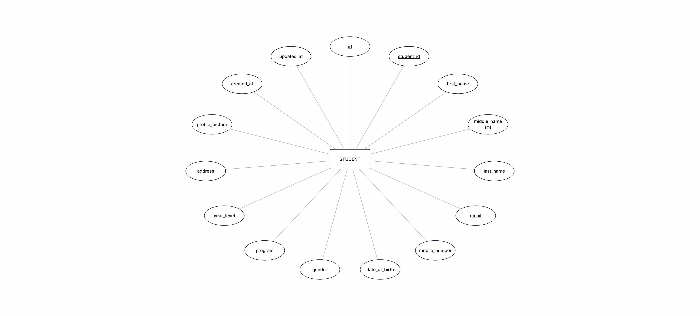

# Student Registration System


A responsive **Student Registration System** built with Laravel for **ITST 302 – Client-Server Technologies, Week 4 Laboratory Activity (Mini Project 03)**. The system allows students to register through a web form, validates submitted information on the server, uploads a profile picture using Laravel Storage, stores student records in MySQL, and displays the registered student's profile after a successful submission.

---

## Table of Contents

- [Project Overview](#project-overview)
- [Objectives](#objectives)
- [Features](#features)
- [Technologies Used](#technologies-used)
- [System Requirements](#system-requirements)
- [Installation and Setup](#installation-and-setup)
- [Laravel Request Lifecycle](#laravel-request-lifecycle)
- [Validation Rules](#validation-rules)
- [Database Design](#database-design)
- [Registration Flowchart](#registration-flowchart)
- [Student Registration ERD](#student-registration-erd)
- [Laravel Request Lifecycle Diagram](#laravel-request-lifecycle-diagram)
- [Application Screenshots](#application-screenshots)
- [Problems Encountered](#problems-encountered)
- [Solutions Implemented](#solutions-implemented)
- [Project Structure](#project-structure)
- [Git Commit Milestones](#git-commit-milestones)
- [Reflection](#reflection)
- [References](#references)

---

# Project Overview

Student registration is a common feature in schools, universities, companies, hospitals, government offices, and other enterprise information systems. It allows organizations to collect important information from users and store it in a structured database for future use.

This project replaces a paper-based registration process with a simple digital registration module. A student can enter personal, academic, and contact information through a responsive registration form. Laravel then processes the request, validates the submitted data, uploads the student's profile picture, stores the registration record in MySQL, and redirects the user to a student profile page.

The project demonstrates the Laravel request lifecycle from the browser to the route, controller, validation process, model, database, and final response.

---

# Objectives

The main objectives of this project are to:

1. Develop a student registration form using Laravel Blade templates.
2. Process client requests using Laravel routes and controllers.
3. Implement server-side validation for all required registration fields.
4. Prevent duplicate Student IDs and email addresses.
5. Validate email addresses, numeric mobile numbers, dates, and uploaded images.
6. Upload and store student profile pictures using Laravel Storage.
7. Store registered student information in a MySQL database.
8. Display validation error messages when invalid information is submitted.
9. Display a flash success message after a successful registration.
10. Display the complete registered student profile after submission.
11. Create a responsive interface that works on desktop, tablet, and mobile screen sizes.
12. Practice Git and GitHub version control using meaningful commits.
13. Document the development process using Markdown, screenshots, diagrams, and reflection.

---

# Features

The Student Registration System includes the following functionality:

- Responsive student registration form
- Student ID registration
- First, middle, and last name fields
- Email address collection
- Mobile number collection
- Date of birth input
- Gender selection
- Program input
- Year level selection from 1st to 6th Year
- Complete address input
- Required profile picture upload
- JPG, JPEG, and PNG image validation
- Maximum profile picture size of 2 MB
- Server-side Laravel validation
- Unique Student ID validation
- Unique email validation
- Numeric mobile number validation
- Prevention of future dates of birth
- Error summary banner
- Field-specific validation messages
- Preservation of previously entered form data after validation errors
- MySQL student record storage
- Laravel Storage integration
- Student profile page
- Uploaded profile picture display
- Flash success notification
- Responsive desktop, tablet, and mobile layouts
- Font Awesome interface icons
- Public GitHub repository with meaningful commit history

---

# Technologies Used

| Technology | Purpose |
|---|---|
| Laravel 12 | Main web application framework |
| PHP 8.2+ | Server-side programming language |
| MySQL / MariaDB | Relational database |
| Blade | Laravel templating engine |
| HTML5 | Page structure and forms |
| CSS3 | Responsive interface and styling |
| Font Awesome | Interface icons |
| XAMPP | Local Apache/MySQL development environment |
| phpMyAdmin | Database administration |
| Git | Version control |
| GitHub | Source-code repository |
| ERDPlus | Entity Relationship Diagram |
| Draw.io / diagrams.net | Flowchart and request lifecycle diagrams |

---

# System Requirements

Before running the project, make sure the following are installed:

- PHP 8.2 or later
- Composer
- Laravel-compatible PHP extensions
- MySQL or MariaDB
- Git
- A modern browser
- XAMPP, Laragon, or another local server environment if preferred

Node.js and npm may also be installed because they are included in a standard Laravel development workflow, although this project's interface uses Blade and inline CSS and does not depend on a custom JavaScript build to display the registration pages.

---

# Installation and Setup

## 1. Clone the repository

```bash
git clone https://github.com/reyben-codes/week04-student-registration.git
```

Move into the project directory:

```bash
cd week04-student-registration
```

## 2. Install PHP dependencies

```bash
composer install
```

## 3. Create the environment file

On Windows CMD:

```cmd
copy .env.example .env
```

On PowerShell, macOS, or Linux:

```bash
cp .env.example .env
```

## 4. Generate the application key

```bash
php artisan key:generate
```

## 5. Create the database

Create a MySQL database named:

```text
week04_student_registration
```

## 6. Configure the database connection

Update the `.env` file:

```env
DB_CONNECTION=mysql
DB_HOST=127.0.0.1
DB_PORT=3307
DB_DATABASE=week04_student_registration
DB_USERNAME=root
DB_PASSWORD=
```

> The project was developed locally using XAMPP MySQL on port `3307`. If your MySQL server uses the default port, change `DB_PORT` to `3306`.

Clear cached configuration after changing `.env`:

```bash
php artisan config:clear
```

## 7. Run the migrations

```bash
php artisan migrate
```

## 8. Create the public storage link

```bash
php artisan storage:link
```

This creates a symbolic link between:

```text
public/storage
```

and:

```text
storage/app/public
```

Uploaded student profile pictures are stored under:

```text
storage/app/public/profile-pictures
```

## 9. Start the application

```bash
php artisan serve
```

Open:

```text
http://127.0.0.1:8000
```

The root route redirects automatically to the student registration form.

---

# Laravel Request Lifecycle

The registration process follows Laravel's request-response lifecycle.

### 1. Browser

The user opens the registration page at:

```text
/register
```

The student fills out the form, selects a profile picture, and clicks **Register Student**.

### 2. Route

The form sends a `POST` request to:

```text
/students
```

The route is defined in:

```text
routes/web.php
```

and maps the request to:

```php
StudentController::store()
```

### 3. Controller

`StudentController` receives the request using:

```php
public function store(Request $request)
```

The controller is responsible for validating the request, storing the profile picture, creating the student record, and returning the correct response.

### 4. Validation

Laravel validates all submitted fields before any record is stored.

If validation fails, Laravel automatically redirects the user back to the registration form and provides validation errors and previously entered input.

If validation succeeds, the request continues to file upload and database storage.

### 5. Laravel Storage

The profile picture is stored on the `public` disk inside:

```text
storage/app/public/profile-pictures
```

Only the generated relative file path is saved in the database.

### 6. Model

The `Student` model represents the `students` table.

The controller uses:

```php
Student::create($validated);
```

to create the registered student record.

### 7. Database

The student information is inserted into the MySQL `students` table.

### 8. Response

After the record is created, Laravel redirects to:

```text
/students/{student}
```

and sends a flash success message.

### 9. Blade View

The student profile Blade view displays:

- Uploaded profile picture
- Student name
- Student ID
- Email
- Mobile number
- Date of birth
- Gender
- Program
- Year level
- Address
- Success notification

---

# Validation Rules

Server-side validation is implemented inside `StudentController`.

| Field | Validation Rules | Purpose |
|---|---|---|
| `student_id` | `required`, `unique` | Ensures every student has an ID and prevents duplicate IDs |
| `first_name` | `required`, `string`, `max:100` | Prevents missing or excessively long first names |
| `middle_name` | `nullable`, `string`, `max:100` | Allows students without a middle name |
| `last_name` | `required`, `string`, `max:100` | Ensures a valid last name is supplied |
| `email` | `required`, `email`, `unique` | Ensures correct email format and prevents duplicates |
| `mobile_number` | `required`, `numeric` | Ensures the mobile number contains numeric characters |
| `date_of_birth` | `required`, `date`, `before_or_equal:today` | Ensures a valid date and prevents future birth dates |
| `gender` | `required` | Requires a gender selection |
| `program` | `required` | Requires an academic program |
| `year_level` | `required`, `integer`, `min:1`, `max:6` | Limits registration to realistic year levels |
| `address` | `required` | Ensures a complete address is provided |
| `profile_picture` | `required`, `image`, `mimes:jpg,jpeg,png`, `max:2048` | Restricts uploads to supported images of up to 2 MB |

## Why Server-Side Validation Is Important

Client-side validation improves user experience, but it can be bypassed by disabling browser validation or manually creating an HTTP request. Server-side validation ensures that Laravel verifies the data regardless of how the request reaches the server.

The system therefore uses both HTML form validation and Laravel server-side validation. Laravel remains the final authority before information is written to the database.

---

# Database Design

The project uses a `students` table created through a Laravel migration.

## Students Table

| Column | Data Type | Constraints / Description |
|---|---|---|
| `id` | BIGINT UNSIGNED | Primary Key, Auto Increment |
| `student_id` | VARCHAR(255) | Required, Unique |
| `first_name` | VARCHAR(255) | Required |
| `middle_name` | VARCHAR(255) | Nullable |
| `last_name` | VARCHAR(255) | Required |
| `email` | VARCHAR(255) | Required, Unique |
| `mobile_number` | VARCHAR(255) | Required |
| `date_of_birth` | DATE | Required |
| `gender` | VARCHAR(255) | Required |
| `program` | VARCHAR(255) | Required |
| `year_level` | TINYINT UNSIGNED | Required |
| `address` | TEXT | Required |
| `profile_picture` | VARCHAR(255) | Stores the relative uploaded image path |
| `created_at` | TIMESTAMP | Laravel timestamp |
| `updated_at` | TIMESTAMP | Laravel timestamp |

### Primary Key

```text
id
```

is the primary key of the table.

### Unique Constraints

The following fields are unique:

```text
student_id
email
```

This prevents duplicate student records based on these identifiers.

### Nullable Field

```text
middle_name
```

is nullable because not every student has a middle name.

### Profile Picture Storage

The actual image is not stored inside MySQL. Only the relative path is saved, for example:

```text
profile-pictures/AbCdEf123456.jpg
```

The actual file is stored inside Laravel Storage.

---

# Registration Flowchart

The registration flowchart illustrates the full process from opening the registration page up to displaying the registered student's profile.



### Flow Summary

```text
Open Registration Page
        ↓
Fill Out Registration Form
        ↓
Upload Profile Picture
        ↓
Submit Form
        ↓
Laravel Validation
    ↙           ↘
 Invalid        Valid
   ↓              ↓
Display Errors   Store Image
   ↓              ↓
Return to Form   Save File Path
                  ↓
               Save Student
                  ↓
               MySQL Database
                  ↓
             Success Message
                  ↓
             Student Profile
```

---

# Student Registration ERD

The Entity Relationship Diagram shows the `STUDENT` entity and its attributes.



The ERD was created using ERDPlus. The current mini project contains one main application entity, `STUDENT`, because no additional relational entities are required by the registration module.

---

# Laravel Request Lifecycle Diagram

The following diagram illustrates how the student registration request moves through Laravel.


The request begins in the browser and moves through the route, controller, validation layer, Laravel Storage, model, MySQL database, response, and Blade view.

---

# Application Screenshots

> The screenshots below document the completed application and development environment.

## Registration Form


The responsive registration form contains all required student information and organized field groups.

---

## Validation Errors


Laravel displays an error summary and field-specific validation messages when invalid or missing information is submitted.

---

## Successful Registration


*Profile pictures in this project are just used for demonstrations.*

A successful form submission redirects the user to the registered student profile.

---

## Flash Success Message


*Profile pictures in this project are just used for demonstrations.*


Laravel session flash data displays a success notification after registration.

---

## Uploaded Profile Picture


*Profile pictures in this project are just used for demonstrations.*


The uploaded image is stored using Laravel Storage and displayed on the student profile page.

---

## Student Profile


*Profile pictures in this project are just used for demonstrations.*


The profile page displays the registered student's personal, academic, and contact information.

---

## Database Records


The `students` table in phpMyAdmin contains the stored registration information and profile-picture file path.

---

## Laravel Project Structure


The project follows Laravel's standard structure with controllers, models, migrations, Blade views, routes, documentation, and screenshots.

---

## Terminal Output


The terminal demonstrates successful Laravel commands such as migrations, routes, or development server execution.

---

## GitHub Repository


The project is stored in a public GitHub repository with an organized structure and meaningful commit history.

---

## Responsiveness (Bonus Image)


The project is responsive on all screen sizes.

---

# Problems Encountered

Several technical issues were encountered while developing the project.

## 1. XAMPP MySQL Could Not Start

XAMPP MySQL initially failed to start because another MySQL Server installation was already running on the default MySQL port `3306`. The existing process appeared as `mysqld.exe`, which caused a port conflict when XAMPP attempted to start its own database server.

## 2. phpMyAdmin Connection Error After Changing the MySQL Port

After moving XAMPP MySQL to port `3307`, phpMyAdmin displayed a connection warning involving the `pma` control user. phpMyAdmin also needed to be configured to connect to the same MySQL server and port being used by Laravel.

## 3. Git Repository Was Initialized in the Wrong Directory

Git was accidentally initialized in:

```text
C:\Users\Reyben
```

instead of:

```text
C:\Users\Reyben\Documents\week04-student-registration
```

Because Git searches parent directories for a `.git` folder, the Laravel project was incorrectly treated as part of the user-directory repository.

## 4. Laravel Could Not Find the Blade View

Laravel displayed:

```text
View [students.create] not found.
```

The `students` directory had been created, but typing the Blade file path directly into CMD did not create the file. Windows attempted to execute the path as a command instead.

## 5. Validation Feedback Initially Looked Too Simple

Laravel validation was already functioning, but the initial validation errors appeared as basic text and bullet points. The success message also appeared as plain text, making the interface look unfinished.

---

# Solutions Implemented

## Solution 1: Use a Different XAMPP MySQL Port

XAMPP MySQL was configured to use:

```text
3307
```

instead of `3306`.

Laravel's `.env` file was then updated:

```env
DB_PORT=3307
```

This allowed the existing MySQL installation and XAMPP MySQL to run without competing for the same port.

## Solution 2: Configure phpMyAdmin for Port 3307

The phpMyAdmin configuration was updated so that it connected to:

```text
127.0.0.1:3307
```

After the change, phpMyAdmin and Laravel accessed the same XAMPP database instance.

## Solution 3: Correct the Git Repository Root

The accidental `.git` directory under:

```text
C:\Users\Reyben
```

was safely renamed as a backup.

Git was then initialized again from the correct Laravel project directory:

```bash
git init
```

After verification using:

```bash
git rev-parse --show-toplevel
```

the repository root correctly became:

```text
C:/Users/Reyben/Documents/week04-student-registration
```

## Solution 4: Create the Missing Blade Files Correctly

The required directory was created:

```text
resources/views/students
```

Then the actual Blade files were created:

```text
create.blade.php
show.blade.php
```

After clearing Laravel's view cache, the registration page loaded successfully.

## Solution 5: Improve Validation and Flash Message UI

The registration page was redesigned with:

- Error summary banner
- Red invalid-field borders
- Field-specific error messages
- Preserved old input
- Responsive form layout
- Font Awesome icons

The student profile page was also redesigned with:

- Styled success banner
- Circular profile picture
- Program and year-level badges
- Information cards
- Responsive mobile layout
- Consistent blue application theme

---

# Project Structure

```text
week04-student-registration/
│
├── app/
│   ├── Http/
│   │   └── Controllers/
│   │       └── StudentController.php
│   │
│   └── Models/
│       └── Student.php
│
├── database/
│   └── migrations/
│       └── *_create_students_table.php
│
├── documentation/
│   ├── registration-flowchart.png
│   ├── student-registration-erd.png
│   └── laravel-request-lifecycle.png
│
├── resources/
│   └── views/
│       └── students/
│           ├── create.blade.php
│           └── show.blade.php
│
├── routes/
│   └── web.php
│
├── screenshots/
│   ├── 01-registration-form.png
│   ├── 02-validation-errors.png
│   ├── 03-successful-registration.png
│   ├── 04-flash-success-message.png
│   ├── 05-uploaded-profile-picture.png
│   ├── 06-student-profile.png
│   ├── 07-database-records.png
│   ├── 08-project-structure.png
│   ├── 09-terminal-output.png
│   └── 10-github-repository.png
│
├── storage/
│   └── app/
│       └── public/
│           └── profile-pictures/
│
├── .env.example
├── artisan
├── composer.json
└── README.md
```

---

# Git Commit Milestones

The project was developed using incremental and meaningful Git commits.

Examples of the main development milestones include:

```text
1. chore: initialize Laravel student registration project
2. feat: create student migration and model
3. feat: add student registration routes and controller
4. feat: build responsive student registration form
5. feat: implement student registration validation
6. feat: store student records and profile pictures
7. feat: display registered student profile
8. feat: redesign registration and profile pages with validation feedback and icons
9. refactor: polish student registration workflow and data presentation
10. docs: add registration flowchart ERD and request lifecycle diagrams
11. docs: add project screenshots
12. docs: complete project README and reflection
```

This commit history demonstrates the gradual development of the system from project initialization to functionality, user interface improvements, testing, and documentation.

---

# Reflection

Developing the Student Registration System helped me understand that a registration form is more than simply collecting information from a user. At first, the project looked like a straightforward activity because the main goal was to create a form and save the information in a database. However, while developing the system, I learned that proper validation, request handling, file management, database design, and user feedback are all important parts of creating a reliable web application.

One of the most important lessons I learned was the value of server-side validation. HTML input attributes such as `required` can help users complete a form correctly, but browser validation alone is not enough because it can be bypassed. Laravel validation ensures that the server checks every submitted request before any information is stored. This is especially important for fields such as the Student ID and email address because duplicates could create inconsistent or incorrect records. I also learned how validation rules can make information more realistic, such as limiting the year level from 1 to 6 and preventing a date of birth from being set in the future.

Handling the profile-picture upload also taught me more about file security and file management. Instead of saving an image directly inside the database, Laravel stores the actual image inside the application's storage directory and saves only the generated path in MySQL. I learned why file type and file size validation are necessary because an upload feature should not accept every type of file. Restricting the upload to JPG, JPEG, and PNG images with a maximum size of 2 MB makes the feature safer and more appropriate for student profile pictures.

The project also gave me a better understanding of Laravel's request lifecycle. When the user submits the registration form, the request travels from the browser to a route and then to the controller. The controller validates the data, processes the uploaded file, uses the Student model to save information in the database, and returns a response to the browser. Seeing this process work in an actual project made the relationship between routes, controllers, models, Blade views, and the database much easier to understand.

I also encountered problems that were not directly related to writing Laravel code. MySQL initially had a port conflict because another MySQL server was already using port 3306, so I configured XAMPP MySQL to use port 3307. I also accidentally initialized Git in my Windows user directory instead of the Laravel project folder. Fixing these problems taught me that development also involves understanding the local environment, command line, configuration files, and version-control tools.

Overall, this activity improved my understanding of how a real registration module is designed and implemented. It showed me why secure input handling, organized database storage, clear error messages, responsive interfaces, and meaningful version control are important in enterprise applications. The experience from this project can be applied to larger systems such as e-commerce platforms, school portals, employee systems, hospital systems, and other applications that need to register and manage users.

---

# References

Laravel. (n.d.). *Laravel documentation*. `https://laravel.com/docs`

MDN Web Docs. (n.d.). *HTML: HyperText Markup Language*. Mozilla. `https://developer.mozilla.org/en-US/docs/Web/HTML`

MySQL. (n.d.). *MySQL reference manual*. Oracle. `https://dev.mysql.com/doc/`

PHP. (n.d.). *PHP manual*. `https://www.php.net/manual/en/`

Fonticons, Inc. (n.d.). *Font Awesome documentation*. `https://fontawesome.com/docs`

---

## Project Repository

**GitHub:** https://github.com/reyben-codes/week04-student-registration

---

## Author

**Student Project – ITST 302 Client-Server Technologies**

Week 4 Laboratory Activity  
Mini Project 03 – Student Registration System
